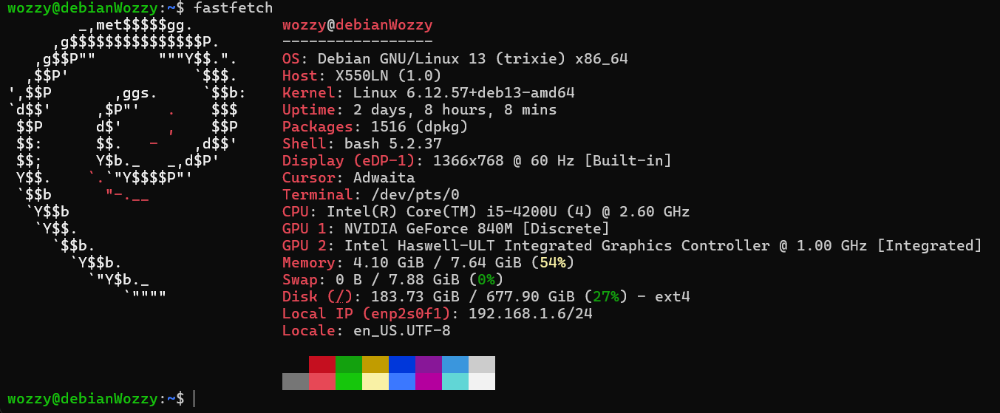

**This is a somewhat journalistic docummentation of my personal homelab for infrastructure learning, network engineering practice, monitoring/observability, and self-hosting. The lab is designed as a controlled environment for testing DNS, VPN routing, service exposure models, and monitoring stacks in a sensible way.**

Primary goals:
- Network and systems engineering practice
- DNS and traffic control experimentation
- Monitoring and observability design
- VPN-based access models
- Real service hosting
---
## Repository Structure

[docs/](docs/) → System architecture, networking design, and documentation files       
[images/](images/) → Screenshot assets      
[incidents/](incidents/) → Incident reports, failure logs, and postmortems     
[monitoring/](monitoring/) → Grafana stack documentation     
[services/](services/) → Service-level documentation     

---
## Hardware
- Host machine: an old ASUS X550LN laptop
- Role: Single-node server host
- Storage: Local disk
- Network: Single-LAN environment
I am planning to deploy a NAS system as soon as I got hands on some extra hardware; as well as adapting the stack in order to the addition of the NAS. That's still a plan, for now. More on [system](docs/1.system).

## OS / Base System
- Host OS: Debian (headless)
- Containerization: Docker, Docker Compose
- Service management: CasaOS

### Network & DNS Flow
- **Primary Network:** Local LAN.
- **Remote Access:** Tailscale is ***the single entry point.***
- **DNS Strategy:** Split-DNS configuration.
- **Ad-blocking:** Pi-hole handles internal requests.
- **Resolution:** Unbound serves as the local recursive resolver.
- **Remote:** Tailscale forces remote clients to use the local Pi-hole instance.

## Service Inventory:
### Infrastructure & Networking

| **Service**   | **Function**       | **Notes**                  |
| ------------- | ------------------ | -------------------------- |
| **Pi-hole**   | DNS Sinkhole       | Primary DNS for LAN & VPN  |
| **Unbound**   | Recursive Resolver | Upstream for Pi-hole       |
| **Tailscale** | Mesh VPN           | Handles all remote ingress |

### Observability Stack
- **Visualization:** Grafana
- **Metrics Database:** Prometheus
- **Collectors:**
    - _Node Exporter_ (Host metrics)
    - _cAdvisor_ (Container metrics)
    - _Blackbox Exporter_ (Uptime/Probing)
- _Missing but planned:_ Centralized logging (Loki/Promtail) is currently out of scope.

### Applications
- **Nextcloud:** File synchronization and collaboration.
- **Navidrome:** Music streaming server.
- **Crafty:** Minecraft server controller.
