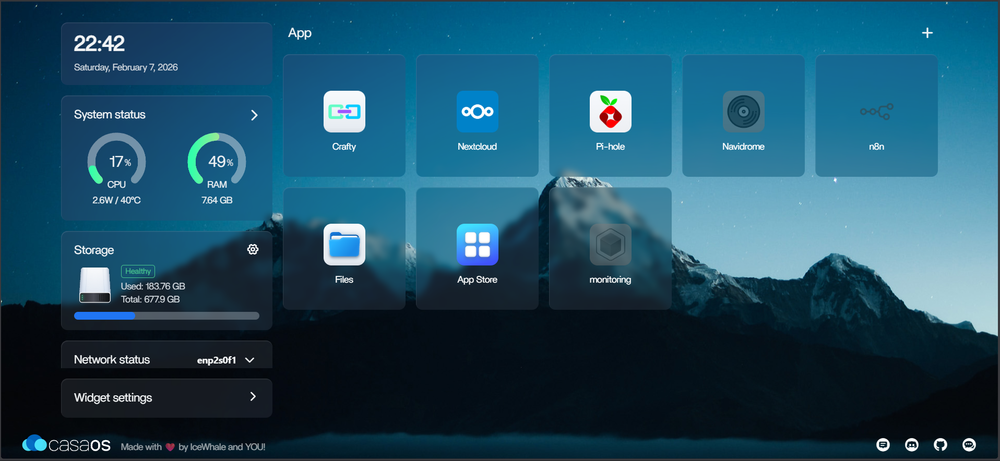

## Hardware
The homelab is running on an old ASUS X550LN laptop of mine, which has been laying around for ages. It was running Windows 10 on 8Gbs of RAM, which was very sluggish in responsiveness and made it hard for me to use the machine properly. I decided to install Debian as it's a more stable OS and have less bloat than Ubuntu. The laptop has been running like a brand new machine ever since. 

I want this machine to mainly run dockerized services, so I installed CasaOS. Surprisingly, the whole Debian system when idling with only CasaOS run in the background only utilize ~1Gb of RAM (and I believe it can run more efficiently if I spent some time tweaking it). Overall, I don't feel like I need to upgrade the machine to 16Gbs of RAM any time soon.

However it did get quite heated when run on a sustained period of time, so that's why I did a teardown in order to clean it up. I've decided that since I want to use this server headless via local LAN and Tailscale VPN anyway, I took the whole screen and keyboard module down, as it makes more room for better air flow. The heat problem was solved. 
[▶ Video demo](https://streamable.com/2kulj7), or [you could find it here](../images/frankenstein.mp4)

## Future plan
The lab is designed to scale horizontally. The current ASUS node will eventually be joined by a secondary machine to separate concerns:
1.  **Node A (Current ASUS):** Dockerized services.
2.  **Node B:** TrueNAS running on Proxmox.
    * This machine would run on the RAID 1 configuration, thus it will have some small networking services running on other Proxmox VMs along with the TrueNAS VM. 

The entire lab will then connects to the home network via a switch, upstreamed to a Xiaomi R3P router running OpenWrt.