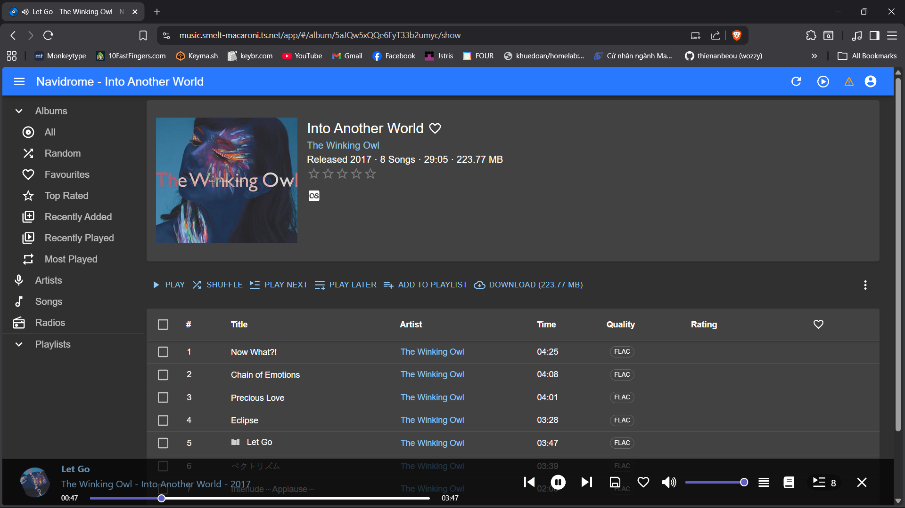

- [ ] I'm thinking about a pwd manager that can be accessed via Tailscale. 
- [ ] dmzs/vlans
- [ ] I might implement cloudflare vpn on the machine and then have the homelab as the exit node on the tailscale network. It's more secure since I'm exposing less stuff to the ISP, and I'd like to use both pihole and a vpn as the same time across devices. 
      That's still a plan for now, since I do acknowledge that this setup is finicky and might make my network route go haywire. 
      Thus I have to think of an on/off switch for the cloudflare vpn in case I don't want to use it or something happened with the connection to cloudflare's servers.

I was able to set TSDProxy up, now I'm able to have "pretty" domain names instead of having to remember my ip:ports for each service:

gonna add this to [networking](docs/2. networking.md) later