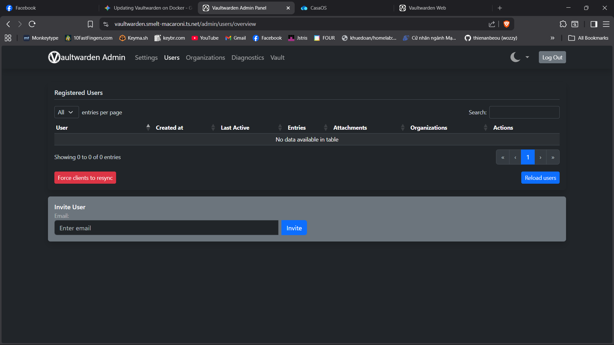
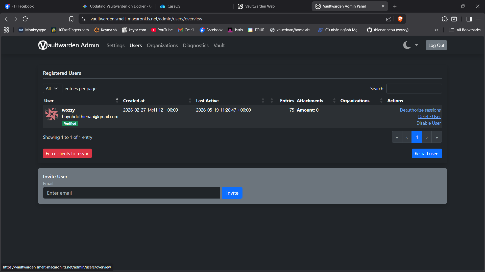

I can't login to access the vault, no matter which way I was trying, via webapp or via browser extension. I was struggling with this for a few days daunting to figure out what went wrong and thought that I have lost the vault. 

However, I was able to access admin console via adding an `ADMIN_TOKEN` environment variable to Vaultwarden via CasaOS configuration for containers, and found out that there's no user. Turns out, CasaOS was acting up and somehow changed the mount database of Vaultwarden, which results in my vault being inaccessible. 
After a quick search using `find` command, I was able to mount the correct data back onto Vaultwarden again. 

The `find` command in mention: 
```bash
sudo find / -name "db.sqlite3" -exec ls -lh {} + 2>/dev/null
```

Before:
After mounting the correct database:

