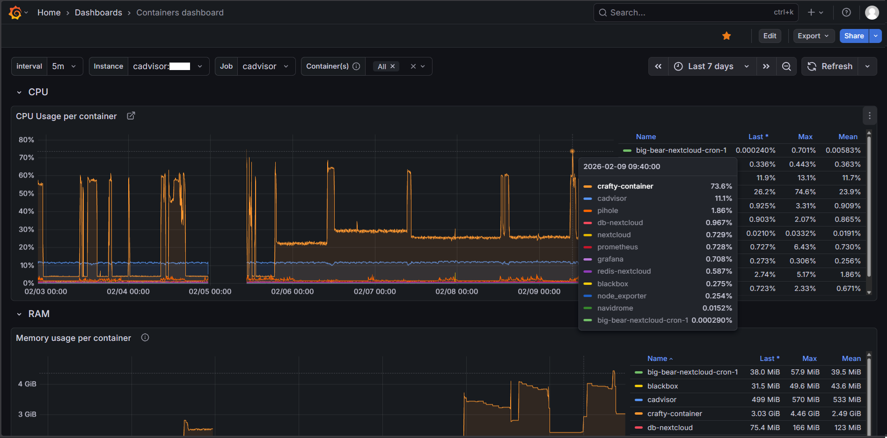
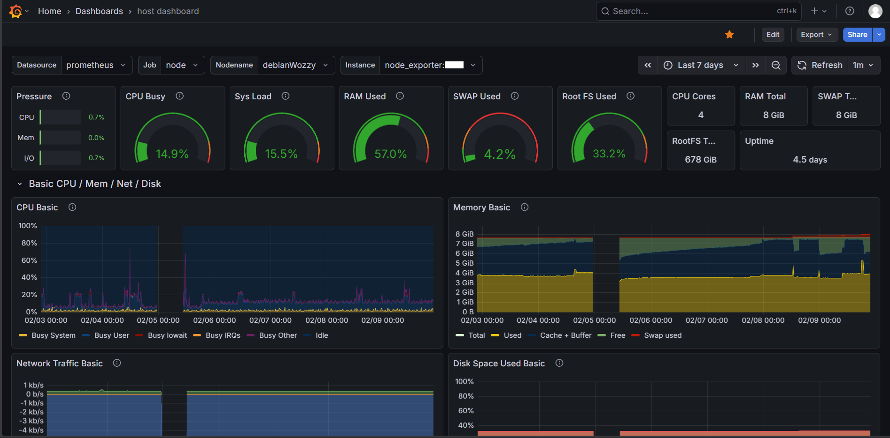
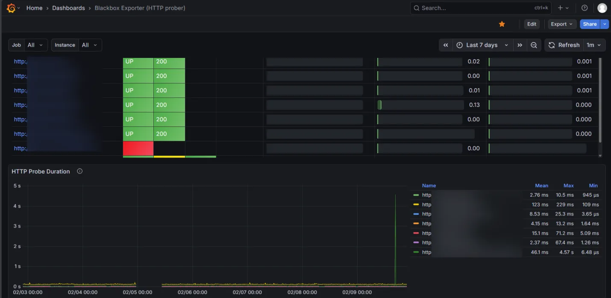

The Grafana stack in this homelab refers to:
Grafana + Prometheus + exporters + cAdvisor + Blackbox exporter.

Quite self-explainatory: Prometheus pull the datas from the exporters, Grafana provide dashboards. 

The stack is currently deployed **server-side on the main host**, not on a separate always-on machine, dedicated hardware node, or external VPS. 
I am aware this is not a high-availability or separation-of-concerns architecture, but it fits the current scale and operational scope of the homelab.

### Future plan
As the system grows, the Grafana stack may be migrated to a dedicated always-on node or external VPS (if I have a budget to rent one, ofc). Planned additions include:
- Loki (log aggregation)
- Promtail (log shipping) or maybe Grafana Alloy
- Alertmanager (alert routing and notification management)
- Extended Grafana components and integrations
This will enable proper observability separation, higher reliability, and scalable monitoring across the system.
