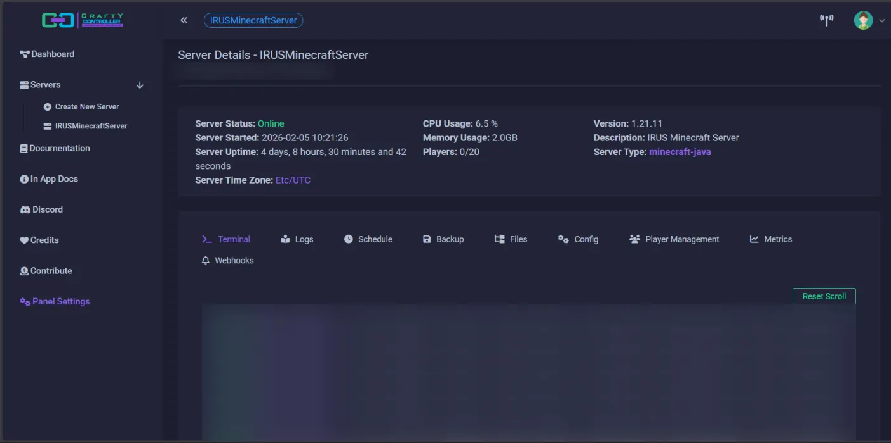
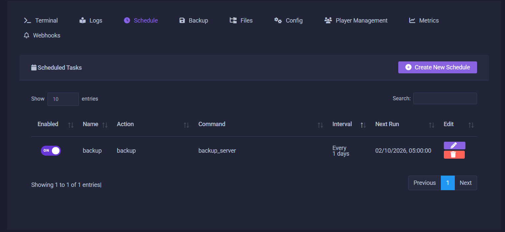
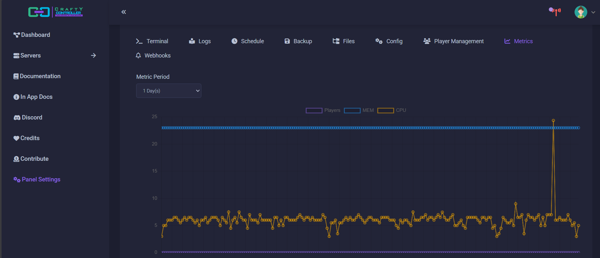

Crafty is used as the Minecraft server management platform, currently hosting one Fabric 1.21.1 server for a private Discord group.

The server has served up to 10 clients, with a peak of 6 concurrent players, while maintaining low resource usage.

The Minecraft service is configured to start automatically when the host server powers on, with automated backups enabled.

Performance optimization mods in use:
- Krypton
- Lithium
- Spark

