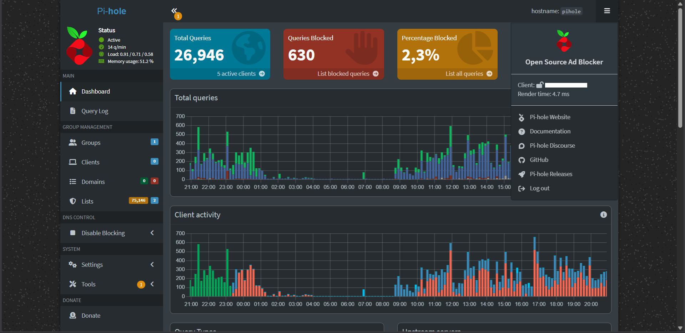
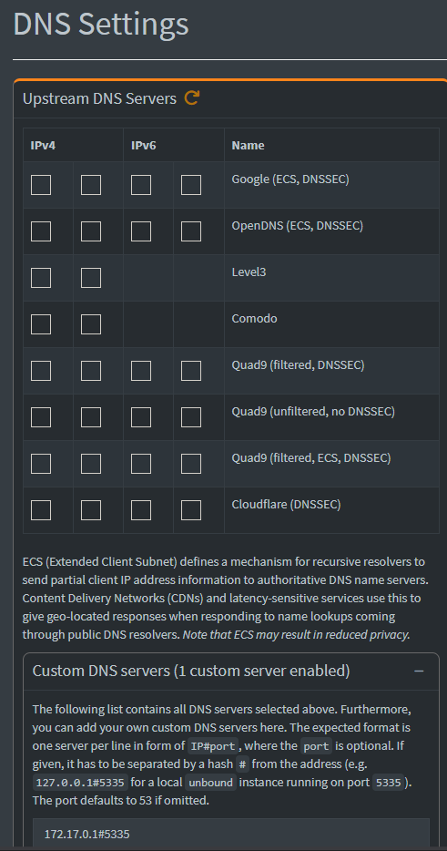
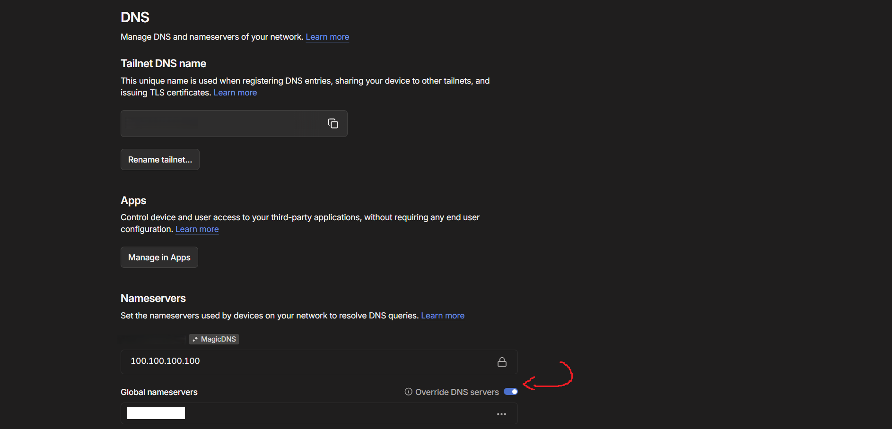

The DNS of the homelab stack consists of Pi-hole, Unbound and Tailscale VPN.   
	Pi-hole handles:   
		- DNS filtering  
		- local DNS resolution   
		- policy-based blocking  
		- internal name resolution    
	Unbound acts as:   
		- a local recursive resolver   
		- caching layer   
		- upstream resolution path  

This stack provides a self-contained DNS infrastructure without reliance on external resolvers.

## Access Model
- This is set as the DNS resolver of the server itself 
- Remote access via Tailscale (DNS override enabled)

As I find some annoying sites are able to detect adblocking, an on/off switch for adblocking function would be nice. That's why this DNS stack filtering is opt-in and client-controlled via Tailscale connection state; thus the stack is managed by the server only and is not the upstream DNS of the R3P (the whole network) as some devices later on might not need this.

Thus, with the addition of Tailscale, I basically have this DNS stack available on any device, anytime, anywhere.  

## Design Philosophy
- Local-first resolution
- No external DNS dependency
- Centralized policy control
- Offloading DNS processing from the router
- Privacy-focused resolution model

The typical traffic flow of this stack should be:
Client → Tailscale (if remote) → Pi-hole → Unbound → Root/Authoritative DNS → Response

## Future Plan
- This DNS stack design may change as the system scales to multiple nodes and additional device types (IoT, external systems, segmented networks), potentially requiring changes in resolution strategy and policy control.
