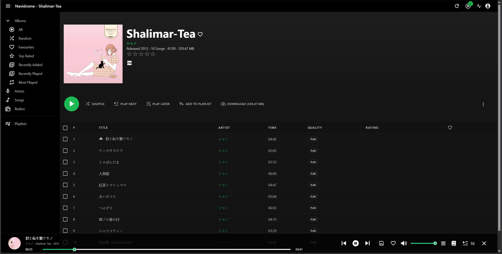
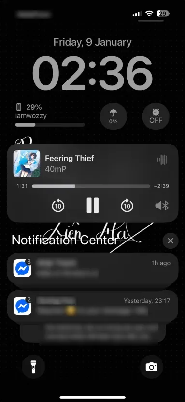
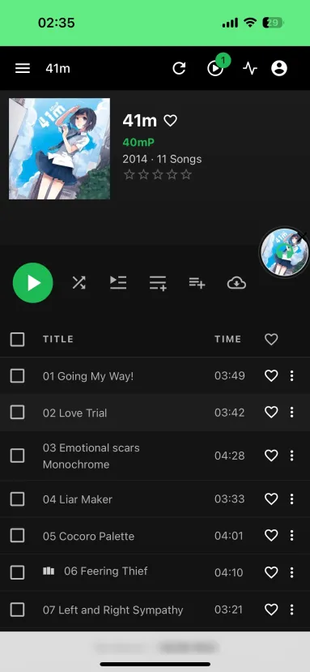

Navidrome is used as the personal music streaming service for the homelab, provides centralized access to a private music library, enabling streaming across devices without relying on external streaming platforms.

The music library is sourced from a data folder synchronized via Nextcloud, since I don't want the homelab to have to actually store my music data twice.
A Last.fm API is added to track listening activity and scrobbles.

Access model:
- Internal access via LAN
- Remote access via Tailscale

The service is designed for:
- Personal music streaming
- Cross-device playback
- Centralized media library management
- Offline independence from third-party platforms

Future plan:
- Storage migration to dedicated NAS backend

