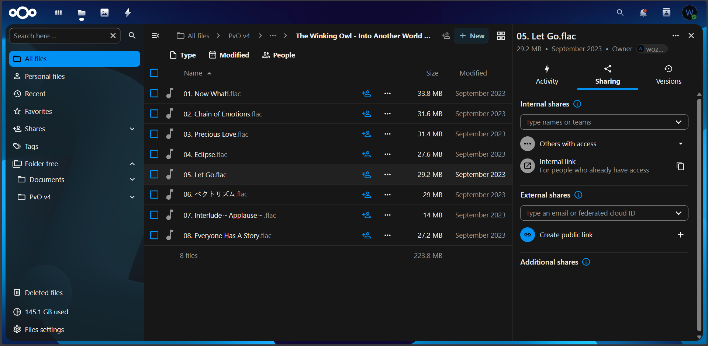

Nextcloud is used as the private cloud platform for personal file storage, synchronization, and data access.

It serves as a centralized storage system for documents, media, and backups, replacing reliance on third-party cloud services for personal data.

Access model:
- Internal access via LAN
- Remote access via Tailscale

The service is designed for:
- File synchronization
- Cross-device access
- Personal data ownership
- Private cloud use cases

An additional account is created for trusted friends connected via the Tailscale network, allowing controlled shared access when needed.

Future plan:
- Storage expansion via a dedicated NAS node
- Potential migration to an external storage backend (TrueNAS)

